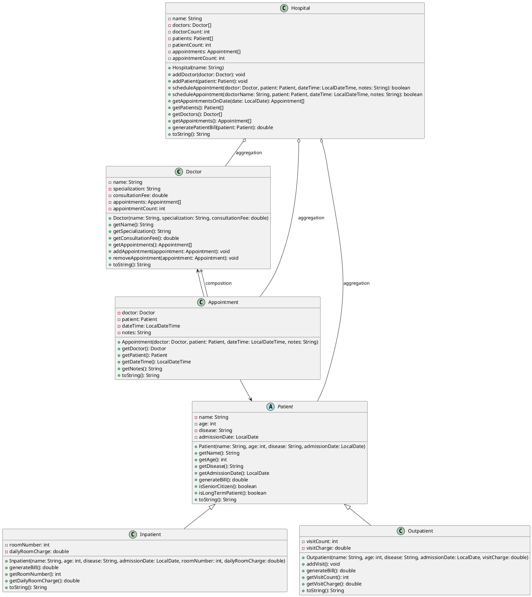

# Hospital Management System UML Class Diagram

## Implementation Details

### Doctor Class
- Manages doctor's information and their appointments.
- Uses composition with Appointment class.

### Patient Class (Abstract)
- Base class for all patients.
- Provides common attributes and methods.
- Includes discount logic for seniors and long-term patients.

### Inpatient Class
- Extends Patient for hospitalized patients.
- Billing based on room charges and days admitted.
- Applies discounts for seniors and long-term stays.

### Outpatient Class
- Extends Patient for non-hospitalized patients.
- Billing based on visit count and charges.
- Supports multiple follow-up visits.

### Appointment Class
- Represents scheduled appointments.
- Links doctor and patient with date/time and notes.

### Hospital Class
- Central management class.
- Uses aggregation for doctors, patients, and appointments.
- Provides overloaded methods for scheduling appointments.
- Manages billing and appointment queries.